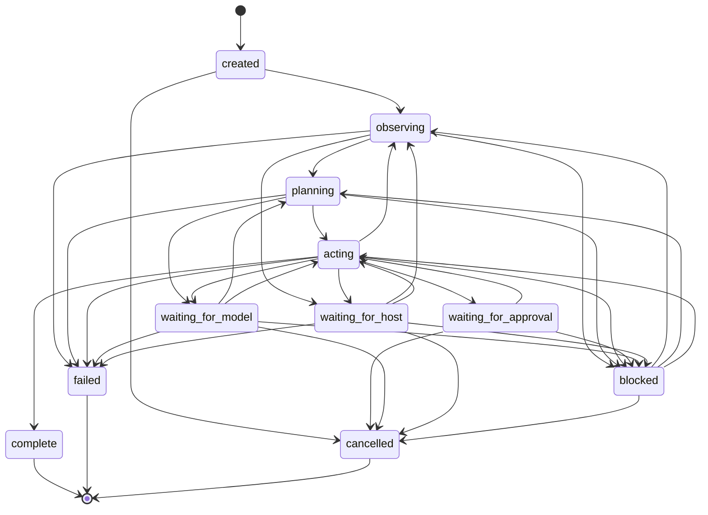

# Task Lifecycle and Control Loop

Consent Scheme's control loop is the runtime layer that turns Scheme-readable
building blocks into an inspectable task-oriented agent. It receives a user
goal or a resumed task, observes context, routes model work, updates plans,
invokes Scheme helpers and host capabilities through policy, records
transcripts and audit entries, pauses when authority is missing, and stops with
a receipt that explains why.

This design builds on [Architecture and threat model](architecture.md),
[Capability Environment and Effect Lowering](capability-environment.md),
[Session Lifecycle and Snapshots](session-lifecycle.md),
[Jobs, Cancellation, and Streaming Yields](jobs.md), and
[Secrets, Local-Only Context, and Redaction](privacy.md). The control loop does
not grant authority by itself. It composes the session, capability,
approval, job, provider, memory, plan, rule, pattern, skill, transcript, and
audit surfaces into one loop.

The contract is Scheme-readable data. A host may keep private handles,
threads, provider clients, UI buffers, or caches, but the task state and every
decision that crosses the control-loop boundary must be printable and
replayable as ordinary Scheme datums.

## Lifecycle States

Task state is a public symbol. The state machine intentionally separates active
work, pause states, and stop states so hosts can distinguish "resume this
later" from "this task is done."

The diagram uses underscores for Mermaid state identifiers; the table below it
keeps the public Consent Scheme state symbol spellings.



| State | Meaning | Normal exits |
| --- | --- | --- |
| `created` | A task datum exists but no observation has run. | `observing`, `cancelled` |
| `observing` | The loop is collecting context, memory, rules, skills, patterns, host state, or provider diagnostics. | `planning`, `waiting-for-host`, `blocked`, `failed` |
| `planning` | The loop is creating or updating an `(agent plan)` record. | `acting`, `waiting-for-model`, `blocked`, `failed` |
| `acting` | The loop is evaluating Scheme helpers or requesting host capabilities. | `observing`, `waiting-for-approval`, `waiting-for-host`, `waiting-for-model`, `blocked`, `complete`, `failed` |
| `waiting-for-approval` | A policy gate produced an approval request and the task can resume after a host or user decision. | `acting`, `blocked`, `cancelled` |
| `waiting-for-model` | A provider request is in flight or queued by provider policy. | `planning`, `acting`, `blocked`, `failed`, `cancelled` |
| `waiting-for-host` | A host capability, job, process, or adapter callback is pending. | `observing`, `acting`, `blocked`, `failed`, `cancelled` |
| `blocked` | The loop cannot continue without new authority, input, dependency work, or a changed environment. | `observing`, `planning`, `acting`, `cancelled` |
| `cancelled` | The user, host, or budget controller cancelled the task. | terminal |
| `failed` | The loop stopped because an error condition escaped the retry or recovery policy. | terminal unless a host creates a resumed task |
| `complete` | The verifier accepted the result or the goal's stop condition was satisfied. | terminal |

Allowed transitions are intentionally narrow:

```text
created -> observing -> planning -> acting
acting -> observing
acting -> complete
observing|planning|acting -> waiting-for-approval|waiting-for-model|waiting-for-host
waiting-for-approval|waiting-for-model|waiting-for-host -> observing|planning|acting
observing|planning|acting|waiting-for-approval|waiting-for-model|waiting-for-host -> blocked
created|observing|planning|acting|waiting-for-approval|waiting-for-model|waiting-for-host|blocked -> cancelled
observing|planning|acting|waiting-for-model|waiting-for-host -> failed
blocked -> observing|planning|acting
```

Retry policy may move a task from `failed` into a new task whose
`resumed-from` field names the failed task. The original task remains immutable
as a stop receipt.

## Pause and Stop Receipts

Pausing and stopping are first-class because they drive different host
behavior. A pause receipt preserves enough information for a host to display,
resume, or transfer the task. A stop receipt preserves enough information for a
user, debugger, transcript viewer, or future replay runner to understand why no
further work happened.

```scheme
(task-pause
  (task task-17)
  (state waiting-for-approval)
  (observed-state
   (observation-set obs-17
     (summary "edit requires confirmation")))
  (intended-next-action action-17)
  (capability-gate
   (capability-decision
     (id dec-17)
     (status needs-approval)
     (policy (buffer-edit confirm))
     (reason "mutating buffer action requires approval")))
  (model-route
   (model-routing-decision
     (status selected)
     (role approval-explainer)
     (provider local-openai-compatible)
     (model qwen-coder)))
  (approval-status pending)
  (verifier-result not-run)
  (pause-reason approval-required))
```

```scheme
(task-stop
  (task task-17)
  (state complete)
  (observed-state
   (observation-set obs-31
     (summary "tests passed and diff matches plan")))
  (intended-next-action none)
  (capability-gate none)
  (model-route none)
  (approval-status none)
  (verifier-result
   (verifier-result
     (status passed)
     (evidence ((test make-test) (diff reviewed)))))
  (stop-reason completed-goal))
```

Stop reasons include `completed-goal`, `waiting-for-user-input`,
`approval-denied`, `authority-unavailable`, `budget-exhausted`,
`repeated-failed-action`, `model-provider-unavailable`, `host-effect-timeout`,
`cancelled-by-user`, `condition-failed`, and `insufficient-evidence`.

## Control Loop

The outer loop is deterministic around policy and state transitions even when
model output is nondeterministic.

1. Receive a user task, protocol request, or resumed task datum.
2. Create or resume the session and derive the task capability environment.
3. Load applicable context, memory, rules, skills, workflow patterns, current
   plan state, provider diagnostics, and transcript history.
4. Enter `observing` and collect read-only observations through Scheme helpers
   or capability requests.
5. Select model roles through provider routing policy. The runtime chooses the
   route; model output may suggest a role but cannot authorize the route.
6. Enter `planning` and create or update an `(agent plan)` record.
7. Enter `acting` and choose the next action from the plan, model result,
   rules, and verifier state.
8. Invoke pure Scheme helpers directly under budget. Invoke host observations
   and mutations only through `capability-request` and policy.
9. Consume `(agent io)` events: `agent-yield`, `agent-progress`,
   `agent-request`, `agent-warn`, model stream events, host progress, warnings,
   and results.
10. Update the task record, step record, plan, memory, transcript, budget
    ledger, and audit sink with the new Scheme-readable data.
11. If a policy gate requires approval, move to `waiting-for-approval` with a
    pause receipt.
12. If a provider or host operation is pending, move to `waiting-for-model` or
    `waiting-for-host` with a pause receipt.
13. If authority, input, dependencies, or evidence are missing, move to
    `blocked` with a pause receipt.
14. If the verifier passes, move to `complete` with a stop receipt.
15. If cancellation, exhaustion, repeated failure, provider unavailability, or
    an unrecovered condition occurs, move to `cancelled` or `failed` with a
    stop receipt.
16. Otherwise continue from the next observation or action.

Runtime policy decisions, user-facing rules, and model suggestions are separate
inputs. Policy decides whether authority may be used. Rules guide behavior and
collaboration. Model output proposes text, plans, code, summaries, or review
findings. A model suggestion never creates a grant, resolves an approval, marks
a verifier as passed, or bypasses redaction.

## Scheme-Readable Records

These records are stable design shapes for issues that turn the lifecycle into
executable code. They are ordinary datums, not host objects.

```scheme
(agent-task
  (id task-17)
  (state acting)
  (goal "Replace the old helper name and verify tests.")
  (session project-main)
  (scope project)
  (created-at "2026-05-25T12:00:00-0700")
  (resumed-from none)
  (context ((project-root "/repo/") (request-source user)))
  (memory ((memory-ref m-42)))
  (rules ((rule-set project-rules)))
  (skills ((agent-skill refactor-helper)))
  (patterns ((workflow-pattern test-first-change)))
  (plan plan-17)
  (current-step step-2)
  (budget
   (task-budget
     (max-steps 120000)
     (max-host-calls 200)
     (max-provider-tokens 20000)
     (used-steps 3400)
     (used-host-calls 12)
     (used-provider-tokens 820)))
  (provider-routes
   ((planner local-openai-compatible qwen-planner)
    (coder local-openai-compatible qwen-coder)))
  (capability-environment env-task-17)
  (transcript transcript-task-17)
  (audit audit-task-17))
```

```scheme
(agent-step
  (id step-2)
  (task task-17)
  (state acting)
  (goal "Apply the approved edit.")
  (plan-item plan-item-2)
  (attempt 1)
  (observations (obs-10 obs-11))
  (decision decision-2)
  (action action-2)
  (events ())
  (result pending))
```

```scheme
(agent-action
  (id action-2)
  (task task-17)
  (step step-2)
  (kind host-capability)
  (library (emacs buffer edit))
  (binding buffer-replace!)
  (arguments ((handle buffer h-12) 120 140 "consent-read"))
  (requires ((policy buffer-edit)
             (grant region-edit)
             (approval approval-buffer-grant)))
  (expected-outcome
   (observation-needed (kind diff) (source buffer))))
```

```scheme
(agent-observation
  (id obs-11)
  (task task-17)
  (source (agent io))
  (kind progress)
  (value
   (progress
     (phase test)
     (datum (command "make test") (status passed))))
  (redactions ())
  (audit audit-91))
```

```scheme
(agent-decision
  (id decision-2)
  (task task-17)
  (step step-2)
  (observed-state (obs-10 obs-11))
  (selected-action action-2)
  (reason "Plan item has approval and narrow edit grant.")
  (policy-input
   ((capability-decision dec-2)
    (approval-status approved)))
  (model-input
   ((model-routing-decision
      (role coder)
      (provider local-openai-compatible)
      (model qwen-coder))))
  (rules-input ((rule-set project-rules)))
  (verifier-result not-run))
```

```scheme
(agent-completion
  (task task-17)
  (status complete)
  (value
   (task-result
     (summary "Helper rename applied and verified.")
     (artifacts ((diff diff-17) (test make-test)))))
  (stop
   (task-stop
     (task task-17)
     (state complete)
     (stop-reason completed-goal)))
  (transcript transcript-task-17)
  (audit audit-task-17))
```

Records may carry implementation-specific extension fields, but core fields
must remain readable by older hosts. Unknown fields are ignored by readers that
do not need them.

Issue #285 turns the record vocabulary into the `(agent task)` library and the
Emacs-side `consent-task` module. That executable slice exposes:

- public state data in `task-states`
- the explicit transition table in `task-allowed-transitions`
- predicates, constructors, and validators for `agent-task`, `agent-step`,
  `agent-action`, `agent-observation`, `agent-decision`, `task-pause`,
  `task-stop`, `task-wait`, `task-failure`, and `agent-completion`
- structured validation conditions such as
  `(task-condition (kind invalid-transition) (from created) (to complete))`
- shared fixture records in `fixtures/agent/task-lifecycle.scm`

The fixture suite covers normal completion, blocked approval, provider wait,
host wait, cancellation, budget exhaustion, unrecovered failure, resumable
pause receipts, and terminal stop receipts. These are record fixtures, not an
executable task runner; #286 and #287 use the same datums for loop execution
and replay-oriented control-loop fixtures.

## Capability Arbitration

The control loop arbitrates actions before any host effect runs.

Read-only observations request the least authority needed to inspect state. A
read-only action may be allowed by project trust, an existing grant, or a host
policy default, but it still produces an audit record. Examples include current
buffer metadata, project diagnostics, provider diagnostics, VCS status, and
memory reads.

Mutating actions require explicit authority. Buffer edits, file writes,
process control, repository mutation, approval resolution, provider disclosure,
skill script execution, and exported artifacts require matching grants,
policy approval, and any domain-specific approval record before they run.

Arbitration result shapes follow the capability environment vocabulary:

```scheme
(capability-decision
  (id dec-2)
  (request req-2)
  (status approved)
  (policy (buffer-edit confirm))
  (grant region-edit)
  (approval approval-buffer-grant)
  (reason "approved narrow edit"))
```

Denied authority moves the task to `blocked`, `failed`, or `cancelled`
depending on the reason. `approval denied` is a stop reason when the planned
work cannot continue without that effect. `authority-unavailable` is a pause
reason when the user or host can provide a new grant. Stale handles fail closed
before adapter calls:

```scheme
(capability-decision
  (id dec-stale)
  (request req-stale)
  (status denied)
  (reason stale-handles)
  (stale-handles ((handle buffer h-12)))
  (task-state blocked))
```

Repeated stale-handle or denial outcomes should advance the task to a stop
receipt instead of retrying indefinitely.

## Model Provider Roles

Provider routing chooses models for roles, not providers hardcoded in the
control loop. Initial roles are:

| Role | Use |
| --- | --- |
| `planner` | Create or revise task plans and next-step options. |
| `coder` | Generate code, Scheme helpers, patches, or executable snippets. |
| `reviewer` | Review diffs, plans, results, and verifier evidence. |
| `summarizer` | Compress observations, transcripts, and long context. |
| `memory-curator` | Suggest memory reads, writes, confidence changes, and cleanup. |
| `approval-explainer` | Produce user-facing explanations for approval prompts. |
| `cheap-background` | Run low-cost classification, extraction, or progress summarization. |

The runtime may add narrower roles later, but all roles use the same routing
surface:

```scheme
(model-routing-decision
  (status selected)
  (role planner)
  (provider local-openai-compatible)
  (model qwen-planner)
  (kind local)
  (transport openai-compatible-http))
```

Provider routing decisions are audit input. They are not authority decisions
for remote disclosure, tool use, host mutation, approval resolution, or memory
writes.

## Agent Abstraction, Registry, and Selection

Roles and models route individual calls; an *agent* is the composed,
inspectable entity a user selects, sets as default, or lets the harness choose
automatically. The portable `(agent registry)` library owns this abstraction
once for both hosts: the Emacs interpreter and the portable hosts load the same
Scheme source, so the agent datum, the registry, and selection behave
identically without a separate Emacs reimplementation.

An agent is a Scheme-readable datum bundling an id and name, a role, a model (a
model id, the symbol `auto` for role routing, or a model-selection policy
datum), and optional rules, skills, and a budget:

```scheme
(agent
  (id coder-1)
  (name "Coder One")
  (role coder)
  (model portable-coder)
  (rules ())
  (skills ())
  (budget default)
  (description "Writes code."))
```

The registry registers, lists, references, and defaults agents. A fresh
registry is seeded with a general-purpose `default` agent (role `planner`,
model `auto`) and sets it as the default, so automatic selection always
resolves with no further configuration:

| Verb | Effect |
| --- | --- |
| `(make-agent-registry)` | A registry seeded with the `default` agent. |
| `(register-agent registry agent)` | Register an agent, replacing one with the same id. |
| `(agents registry)` | List agents in registration order. |
| `(agent-ref registry id)` | The agent named `id`, or `#f`. |
| `(default-agent registry)` / `(default-agent-id registry)` | The default agent datum / its id. |
| `(set-default-agent! registry id)` | Make an already-registered agent the default. |

Automatic selection is deterministic and policy-visible. `select-agent` takes a
goal/session context and returns an `agent-selection` decision record naming the
chosen agent and the basis and reason for the choice, plus the requested role,
model, goal, session, and the candidate ids considered:

```scheme
(agent-selection
  (status selected)
  (agent (agent (id default) ...))
  (agent-id default)
  (basis default-agent)
  (reason "no goal-specific configuration; resolved to the default agent")
  (requested-role #f)
  (requested-model #f)
  (goal none)
  (session none)
  (considered (default coder-1)))
```

Selection priority is: an explicitly named agent (`explicit-agent`), then the
first agent matching a requested role (`role-match`), then the first agent
matching a requested model (`model-match`), then the default agent
(`default-agent`). The `first-agent` and `no-agent` bases are defensive
fallbacks for a registry constructed without a default; the seeded default
means a registry built through `make-agent-registry` resolves at
`default-agent` or above.

Selection consults only the registry contents and the context — never the
wall clock, host randomness, or a model provider — so a decision record is
reproducible and cross-host identical, matching the D7 agent-layer determinism
stance. The agent's model field records the *intent*; routing that intent to a
concrete provider happens later, when the prompting verbs drive the runner. The
registry itself does not gate authority: it is designed to be session-scoped and
policy-gated by the prompting layer, which enforces session authority and
budgets and fails closed when authority is missing.

## Provider Request Contract

Provider calls use one shared vocabulary for local and remote routes. The same
task lifecycle records reference provider requests, responses, stream events,
errors, budgets, cancellation, transcript entries, and audit entries.

```scheme
(model-provider-request
  (id model-req-17)
  (task task-17)
  (step step-2)
  (role planner)
  (provider local-openai-compatible)
  (model qwen-planner)
  (kind local)
  (transport openai-compatible-http)
  (prompt
   (messages
    ((system "Plan the next Consent Scheme task step.")
     (user "Use the observations and current plan."))))
  (tools
   ((model-tool
      (name local-echo)
      (description "Echo TEXT through a pure local helper.")
      (parameters
       ((text (type string)
         (description "Text to echo."))))
      (returns
       ((type string)
        (description "The echoed text.")))
      (effects (pure)))))
  (tool-choice auto)
  (context
   ((task task-17)
    (plan plan-17)
    (observations (obs-10 obs-11))))
  (disclosure local-only-ok)
  (redactions ())
  (budget
   (provider-budget
     (max-input-tokens 8000)
     (max-output-tokens 1200)
     (max-wall-ms 30000)))
  (cancellation
   (model-provider-cancellation
     (id cancel-model-req-17)
     (status active)))
  (transcript transcript-task-17)
  (audit audit-task-17))
```

```scheme
(model-provider-response
  (id model-res-17)
  (request model-req-17)
  (status ok)
  (content
   (model-message
     (text "Observe the diff, then run the focused test.")
     (tool-calls
      ((tool-call
        (id "call-1")
        (name local-echo)
        (arguments ((text "hello"))))))))
  (usage
   (provider-usage
     (input-tokens 1420)
     (output-tokens 18)))
  (events
   ((model-provider-stream-event
      (request model-req-17)
      (kind final)
      (index 3))))
  (audit audit-104))
```

For OpenAI-compatible transports, `tools`, `tool-choice`, and response
`tool-calls` are a transport-edge projection of the canonical Scheme-readable
records. Tool specs come from typed docstring metadata: the same `parameters`,
`returns`, and `effects` descriptors generate the wire schema, an in-context
example call, and the pure-under-budget versus `capability-request` gate hint.
The JSON projection is one-way; downstream loop, gate, transcript, and audit
code consume the Scheme-readable `model-tool` and `tool-call` datums.

```scheme
(model-provider-stream-event
  (request model-req-17)
  (kind delta)
  (index 2)
  (content "run the focused test")
  (received-at "2026-05-25T12:01:00-0700"))
```

```scheme
(model-provider-error
  (request model-req-17)
  (status unavailable)
  (provider local-openai-compatible)
  (reason "endpoint did not respond")
  (retry retry-with-alternate-provider)
  (task-state blocked))
```

```scheme
(model-provider-cancellation
  (id cancel-model-req-17)
  (request model-req-17)
  (status requested)
  (reason task-cancelled))
```

Remote and local providers must share this request shape. Remote providers add
redaction and disclosure checks before transport. Local inference uses the same
role-routing and lifecycle machinery without requiring remote disclosure.

## Remote and Local Provider Examples

The remote example represents a future remote OpenAI-compatible provider. The
exact production provider adapter is a follow-up implementation detail; the
control-loop contract is the request, redaction, policy, transcript, budget,
cancellation, and audit shape.

```scheme
(model-provider
  (id remote-openai)
  (kind remote)
  (transport openai-compatible-http)
  (endpoint "https://api.openai.example/v1")
  (models
   (((id gpt-example)
     (roles (planner coder reviewer summarizer memory-curator
             approval-explainer cheap-background))
     (privacy public)))))
```

```scheme
(model-provider-request
  (id model-req-remote-1)
  (task task-17)
  (step step-1)
  (role planner)
  (provider remote-openai)
  (model gpt-example)
  (kind remote)
  (transport openai-compatible-http)
  (prompt (messages ((user "Plan the task from the redacted context."))))
  (context
   ((summary "public issue context")
    (redaction
     (kind secret)
     (source provider-credentials)
     (replacement "[redacted]")
     (policy local-only))))
  (disclosure remote-redacted)
  (redactions
   ((redaction
      (kind secret)
      (source provider-credentials)
      (replacement "[redacted]"))))
  (policy
   (capability-decision
     (status approved)
     (policy (remote-provider-routing allow))
     (reason "payload is redacted and contains no local-only context")))
  (budget (provider-budget (max-input-tokens 8000) (max-output-tokens 1200)))
  (cancellation (model-provider-cancellation (status active)))
  (transcript transcript-task-17)
  (audit audit-task-17))
```

If the same remote request carries local-only context, redaction is not enough;
the task pauses or blocks before transport:

```scheme
(capability-decision
  (status denied)
  (policy (remote-provider-routing deny))
  (reason "local-only context requires explicit approval")
  (task-state blocked))
```

The local example uses the OpenAI-compatible local inference path from issue
#26. It shares role routing, task lifecycle, provider request, response,
stream/event, error, provider-budget, model-provider-cancellation, transcript,
and audit vocabulary with the remote example.

```scheme
(model-provider
  (id local-openai-compatible)
  (kind local)
  (transport openai-compatible-http)
  (endpoint "http://127.0.0.1:11434/v1")
  (models
   (((id qwen-coder)
     (roles (planner coder reviewer summarizer memory-curator
             approval-explainer cheap-background))
     (privacy local)))))
```

```scheme
(model-provider-request
  (id model-req-local-1)
  (task task-17)
  (step step-1)
  (role planner)
  (provider local-openai-compatible)
  (model qwen-coder)
  (kind local)
  (transport openai-compatible-http)
  (prompt (messages ((user "Plan from local project context."))))
  (context
   ((summary "private project state")
    (local-only #t)))
  (disclosure local-only-ok)
  (redactions ())
  (policy
   (model-routing-decision
     (status selected)
     (role planner)
     (provider local-openai-compatible)
     (model qwen-coder)
     (kind local)))
  (budget (provider-budget (max-input-tokens 8000) (max-output-tokens 1200)))
  (cancellation (model-provider-cancellation (status active)))
  (transcript transcript-task-17)
  (audit audit-task-17))
```

Credentialed or heavyweight provider runs may be skipped in local developer
verification, but skipped paths must still validate these shared datums with
fakes or fixtures. Issue #289 owns the focused remote and local provider proof
fixtures that exercise the same contract through the minimal task runner.

## Minimal Executable Slice

The smallest useful runner should:

1. Accept one user goal and optional resumed task datum.
2. Create an `agent-task` in `created`, then move through `observing`,
   `planning`, and `acting`.
3. Build a task-scoped capability environment from user, project, session, and
   task layers.
4. Load selected context, memory, rules, skills, and workflow patterns as
   Scheme-readable data.
5. Route at least the `planner` role through `(agent models)` provider policy.
6. Produce or update one `(agent plan)` record.
7. Run at least one pure Scheme helper or read-only host observation through
   the policy path.
8. Consume `(agent io)` events and provider events into the task transcript.
9. Update plan, memory, transcript, audit, and budget datums after each step.
10. Stop as `complete` with an `agent-completion` or pause as `blocked` with a
    `task-pause`.

The executable slice does not need production-grade scheduling, multiple
provider adapters, streaming UI polish, or persistence. Those are follow-up
issues. It must prove that task records, role routing, provider requests,
policy decisions, yields, budgets, transcript entries, and stop receipts are in
one inspectable loop.

## Failure and Stop Conditions

The loop stops or pauses through explicit receipts:

| Condition | State | Receipt reason |
| --- | --- | --- |
| Goal verified | `complete` | `completed-goal` |
| User input is needed | `blocked` | `waiting-for-user-input` |
| Approval denied | `cancelled` or `blocked` | `approval-denied` |
| Authority unavailable | `blocked` | `authority-unavailable` |
| Budget exhausted | `failed` or `blocked` | `budget-exhausted` |
| Repeated failed action | `failed` | `repeated-failed-action` |
| Model unavailable | `blocked` or `failed` | `model-provider-unavailable` |
| Host effect timeout | `blocked` or `failed` | `host-effect-timeout` |
| User cancellation | `cancelled` | `cancelled-by-user` |
| Verifier lacks evidence | `blocked` | `insufficient-evidence` |

Retry policy must be bounded by budget and by repeated-failure receipts. A
model may suggest retrying, but the runtime decides whether retry remains
allowed.

## Proposal-Datum Boundary (D2)

A model's emitted Scheme form is a **proposal**, not authority. The runtime
treats it as data at every step: the runner reads it with the existing reader
(recovering malformed input as data, never as a partial program), then walks it
with the `(agent proposal)` library before any effect runs. The form is never
`eval`'d as raw authority — model output proposes, the policy gate disposes.
This is design tension **D2** (free-form code execution vs. capability-gated
effects), implemented in #286.

A proposal is carried inside a `code-action` agent-action:

```scheme
(agent-action
  (kind code-action)
  (form (begin (read-file "notes.txt")
               (file-write "summary.txt" result))))
```

`analyze-code-action` walks the `form` as data and returns a
`code-action-analysis` that classifies every sub-form without running it:

- **Pure sub-forms** are accounted against a bounded `pure-cost` budget; a walk
  that exceeds the budget stops with a `budget-exhausted` status rather than an
  unbounded traversal.
- **Tool/capability call subtrees** are admitted only when they structurally
  match a registered capability signature generated from typed docstring
  metadata. Required arguments must be present, defaulted optional arguments may
  be omitted, and clear literal type-shape mismatches are rejected before policy
  resolution.
- **Host calls** become `capability-request` datums that the loop routes through
  policy, so the model reaches a host effect only through the gate.
- **Control-plane sub-forms** — minting or attenuating a grant, revoking or
  releasing a handle, resolving an approval, or stamping a verifier as passed —
  are **quarantined** to a denied `capability-decision` and perform no effect:

```scheme
(capability-decision
  (request (grant-capability! token authority))
  (status denied)
  (operation grant-capability!)
  (reason proposal-quarantined-control-plane))
```

The analysis status is `quarantined` whenever any control-plane sub-form is
present, even alongside otherwise-routable host calls, so a single escalation
attempt fails the whole proposed action closed.

Signature admission has three fail-closed receipt reasons. A nonexistent binding
or invalid call shape produces `hallucinated-tool`; a real binding with arity or
advisory type-shape mismatch produces `misapplied-tool`; and a real,
well-formed call that policy denies produces `unauthorized-tool`. The first two
are pre-policy admission failures carried in denied `capability-decision`
datums; the last is the policy-denial arm for an otherwise admitted request.

> **Design decision (resolves tension D2).** Model-proposed code is a proposal
> the loop reads and runs under policy, gated at capability-request granularity.
> We reject the field default — execute model code directly and sandbox after
> the fact (CodeAct, AutoGen, Voyager). The accepted trade is that the gated
> loop is slower and interruptible than a frictionless interpreter. The harder
> sub-problem — pausing and resuming a single sub-expression mid-form across a
> gated call — is deferred to its own future issue; this slice classifies and
> routes whole sub-forms.

The `(agent proposal)` library is host-neutral and single-sourced: the Emacs
interpreter and the portable hosts load the same Scheme source, so a proposal
analysis is byte-identical and replayable across cores, satisfying the D7
agent-layer determinism stance.

## Completion Authority (D3)

`finish` is proposable; `complete` is not. The model proposes
`(action finish ...)`, which the runner records as an `agent-action`, but the
`acting -> complete` transition is reached only when a deterministic,
policy-side **verifier** stamps `verifier-result (status passed)`. A proposal
that self-asserts a pass is ignored: the verifier is non-proposable, so a
critic's verdict, a self-written test, or a literal "FINAL ANSWER" is read data,
never authorization. This is design tension **D3** (who authorizes completion),
implemented in #286.

In the minimal runner the verifier verdict is an injected deterministic value;
in production it runs held-out checks. The outcomes are distinct receipts:

| Proposal | Verifier | Outcome | Receipt |
| --- | --- | --- | --- |
| `finish` | `passed` | `complete` | `task-stop` (`completed-goal`) with an `agent-completion` |
| `finish` | not passed | `blocked` | `task-pause` (`insufficient-evidence`) |

A blocked-for-evidence task is resumable: more observation or action can satisfy
the verifier on a later step. Completion never is — it is authorized once, by
the verifier, and recorded in an `agent-completion`.

> **Design decision (resolves tension D3).** Model output PROPOSES; only a
> deterministic, policy-side verifier authorizes. `finish` is not `complete`. We
> reject the field default — the model, or a model-as-judge, marks its own
> success (ReAct, Voyager, GAIA). SWE-bench's held-out test patch is the
> canonical justification: the agent does not get to grade its own diff. This is
> the most consent-distinctive rule in the loop.

## Runner Scope and Follow-Ups

The minimal runner in #286 is one observation, one plan, a bounded acting loop,
fake-but-shape-correct providers, and an injected verifier. It is single-sourced
as `(agent runner)`, loaded by both cores. It deliberately defers, to the
follow-up issues in [Follow-Up Issues](#follow-up-issues): production scheduling
and parallel workers; provider hardening and the provider matrix (#289, and the
provider capability domain #223); task persistence and resume (#288); the shared
control-loop fixture corpus (#287); the shared budget ledger and stop receipts
(#291); and the human-collaboration UX for runner states (#52). Pausing and
resuming a single proposed sub-expression mid-form across a gated call (noted
under [Proposal-Datum Boundary](#proposal-datum-boundary-d2)) is likewise a
future issue.

## Cross-Cutting Stance Decisions

The agentic prior-art synthesis enumerates seven tensions between the agentic
field's defaults and Consent's stance
([Agentic-harness prior-art synthesis §4](agentic-harness-ideas.md#4-design-tensions-to-decide-deliberately)).
Four are decided where they are implemented: **D1** (JSON vs Lisp-first tool
schemas) in #531, **D2** (free-form code vs capability-gated effects, recorded
in the [Proposal-Datum Boundary](#proposal-datum-boundary-d2) section above) and
**D3** (who authorizes completion, recorded in the
[Completion Authority](#completion-authority-d3) section above) in #286, and
**D4** (memory mutation vs append-only)
in the memory slice. The remaining three are cross-cutting — they bind more
than one implementation slice — and are ratified here as an RFC (#561) before
the work they gate proceeds. Each is framed as the field default versus the
consent-aligned choice. D5 and D6 govern the control loop and are recorded in
this document; **D7** (agent-layer determinism and cross-host parity) is
recorded in [Architecture and threat model](architecture.md) as an extension of
the First-Class Portable Scheme parity invariant, because it is an
architecture-wide rule, and it constrains the Scheme-readable record design this
document defines and #286 implements.

These decisions are binding stance now even where the runtime that exercises
them is far-future. Recording the record vocabulary early prevents drift when
the driver that needs it lands.

### D5 — Tree search and backtracking

*Field default:* search *is* the control flow; the loop expands, scores, and
prunes a tree of model thoughts every step; backtracking silently discards the
pruned subtrees; voting assumes cheap repeated model calls. [ToT,
Building-Effective-Agents, Wang-survey, AutoGen]

*Consent choice:* the deterministic single-track loop in
[Control Loop](#control-loop) remains the control flow. Tree search is an
**opt-in, explicitly budgeted planning sub-mode** entered from `planning`, never
the default driver and never a new lifecycle state. Within it:

- The search tree is **append-only**, like every other agent record. Expansion
  adds nodes; nothing is overwritten or deleted.
- Backtracking is a typed receipt, not a silent discard:

  ```scheme
  (backtrack
    (from node-7)
    (to node-3)
    (reason impossible)
    (discarded-subtree (node-7 node-8 node-9))
    (grants-accounted ((grant region-edit (status released)))))
  ```

  The receipt keeps the discarded subtree as data and accounts for every grant
  the pruned branch acquired, so abandoning a branch can never strand authority.
- **True backtracking is sound only over pure-Scheme subtrees.** A subtree that
  performed a host effect cannot be re-entered as if it had not happened; the
  loop treats such a node as a recorded observation, not a re-runnable state,
  and re-acquires any authority through the normal gate.
- **Voting is a deterministic Scheme function over recorded response datums,**
  not model self-selection: the aggregator reads the candidate response datums
  and reduces them by an explicit, printable rule, so two cores replaying the
  same candidates reach the same verdict.
- The search cost `b·k·T` (branching × samples × depth) **folds into the
  allocation budget**; exhaustion produces a search-exhaustion receipt — a
  `budget-exhausted` stop receipt whose payload names the best partial node
  found — rather than an unbounded spend.

The search driver itself is far-future (synthesis tag *later*, planning
hardening); only the stance and the record vocabulary above are decided now.

### D6 — Autonomy locus: who drives the loop

*Field default:* the model, an MCP server, or a multi-agent manager owns control
flow; autonomy knobs are untracked keyword arguments; self-chaining is capped by
an implicit constant buried in the framework. [MCP, MemGPT, AutoGen, tau-bench,
Toolformer, Building-Effective-Agents]

*Consent choice:* the **deterministic outer loop owns invocation, routing,
eviction, and termination.** Every external initiation is re-cast as a
*proposal* the loop and the policy gate own and adjudicate — it can suggest the
next step but cannot drive it:

- MCP server-initiated sampling (`createMessage`) is a proposed provider request
  the loop must route and the gate must approve, not a call an external party
  pushes into `acting`.
- MemGPT-style heartbeat self-chaining (`request_heartbeat` / continue) is a
  budget-charged, receipted step: the loop honors `continue` only while the step
  and heartbeat budgets allow, else forces a yield.
- AutoGen-style speaker selection is a loop- and policy-resolved routing
  decision with a receipt; the model may propose the next speaker but cannot
  select the route.
- The **non-interactive script drive** is the same shape: a script that drives
  the loop proposes work under the loop's authority; it does not bypass it.

Autonomy knobs become **policy-governed approval/budget data with receipts,**
not free kwargs: `human_input_mode` (NEVER / TERMINATE / ALWAYS) becomes an
approval policy, and `max_consecutive_auto_reply`-style limits become an
explicit budget whose exhaustion emits a receipt (for example
`auto-reply-budget-exhausted` or `heartbeat-budget-exhausted`), folded into the
[Failure and Stop Conditions](#failure-and-stop-conditions) contract.

This is the decision **#400 codifies for the non-interactive (batch/shebang)
script-drive case**, extending the batch fail-closed posture to provider and
agent grants: the script proposes with preloaded authority; the loop and gate
retain authority.

### D7 — Agent-layer determinism and cross-host parity

D7 is recorded in [Architecture and threat model](architecture.md#agent-layer-determinism-and-cross-host-parity),
because it extends the architecture-wide First-Class Portable Scheme parity
invariant rather than the control loop alone. In summary: all nondeterminism is
quarantined to the model channel and recorded as fixed input on resync; agent
records use logical clocks, not wall-clock time; embeddings and other host
acceleration structures are untrusted advisory caches over a content-addressed
store, never the source of truth; learning lives in append-only memory and
content-addressed skills, never in weights; and anything that hashes or behaves
differently across the two cores is a parity defect to fix at root. This
constrains the Scheme-readable record design throughout this document and the
runner #286 builds from it.

## Follow-Up Issues

This design is the umbrella contract for issue #281. Executable work should be
scheduled in focused slices:

- #285: define task lifecycle records and state transitions.
- #286: implement the minimal task runner control loop.
- #287: create shared task control-loop fixtures.
- #288: persist and resume task lifecycle records.
- #289: prove one remote provider API and one local inference API through the
  shared task lifecycle and provider datums.
- #291: define the budget ledger and stop receipts that task, job, provider,
  transcript, and capability records can share.

Existing prerequisite surfaces remain part of the contract: `(agent io)` from
#21, scoped memory from #22, provider routing from #26, approvals and grants
from #30 and #43, jobs and cancellation from #46, redaction from #49, budgets
from #51, rules and patterns from #58 and #59, the capability environment from
#102, and provider capabilities from #223.
