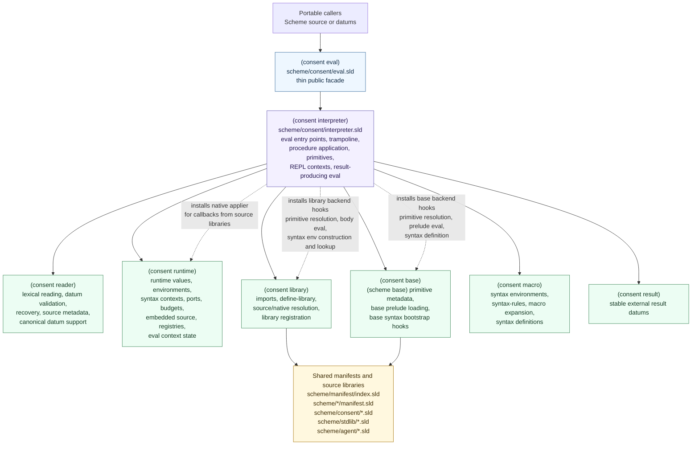
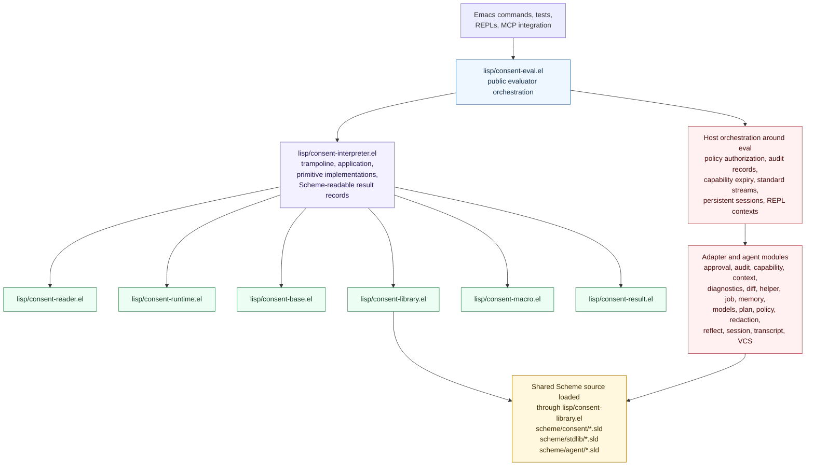
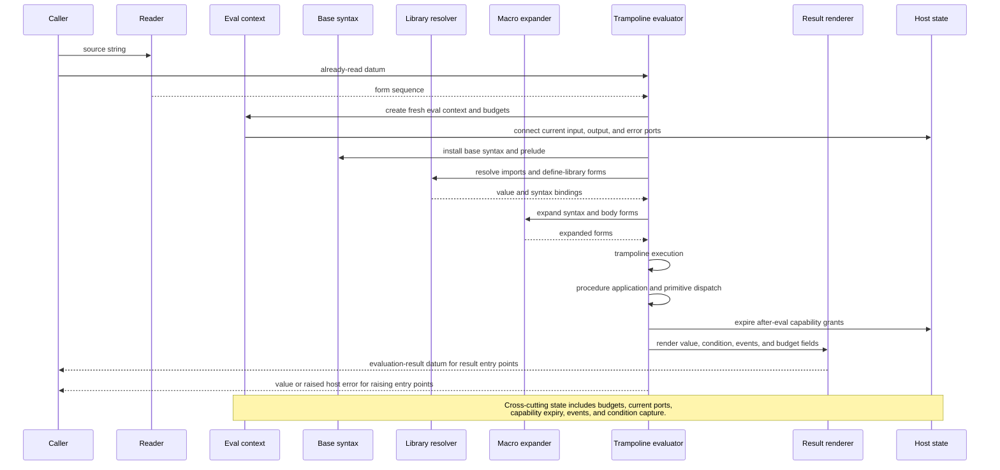
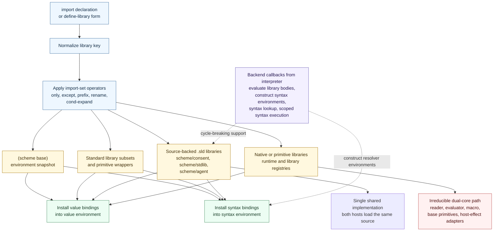
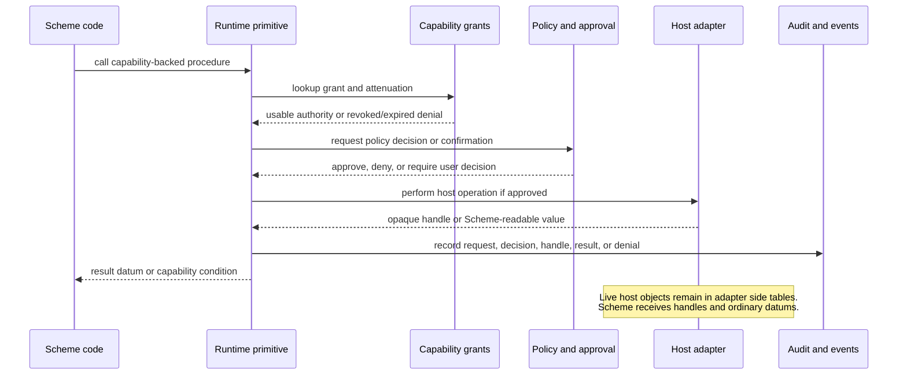
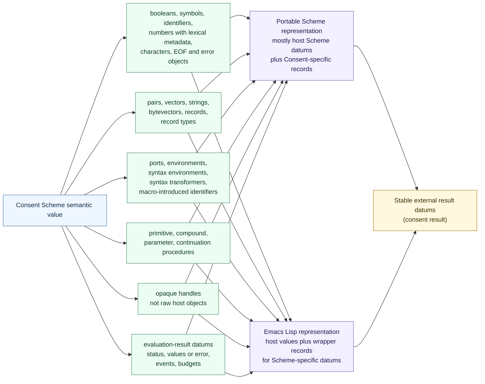
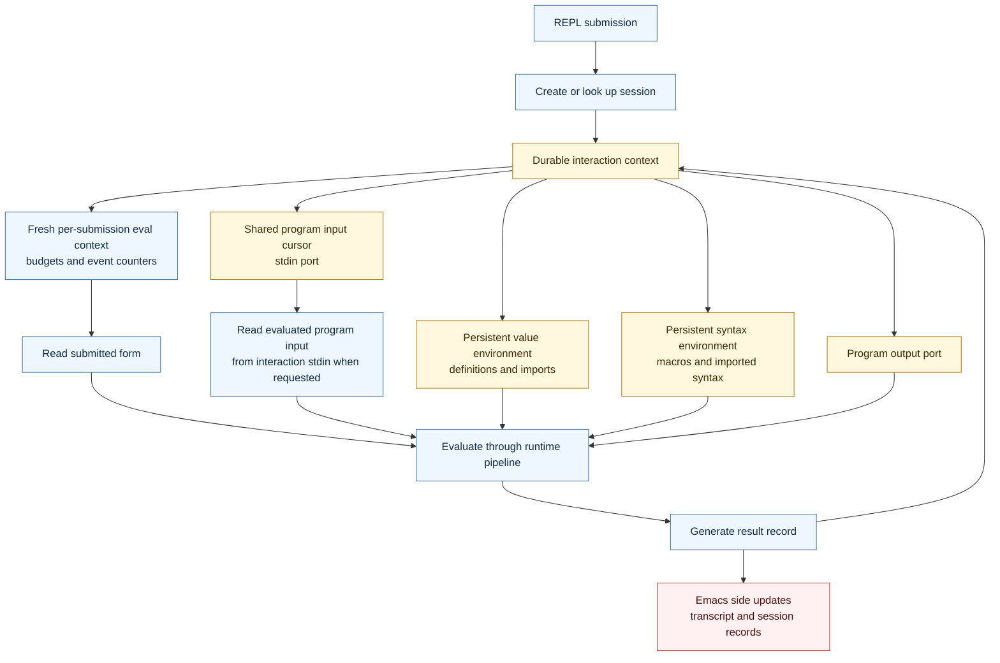
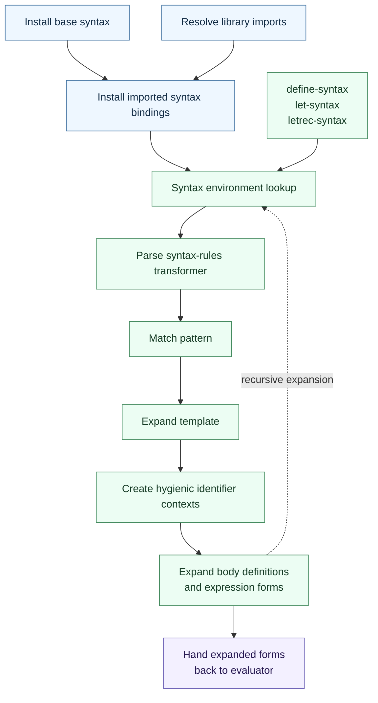
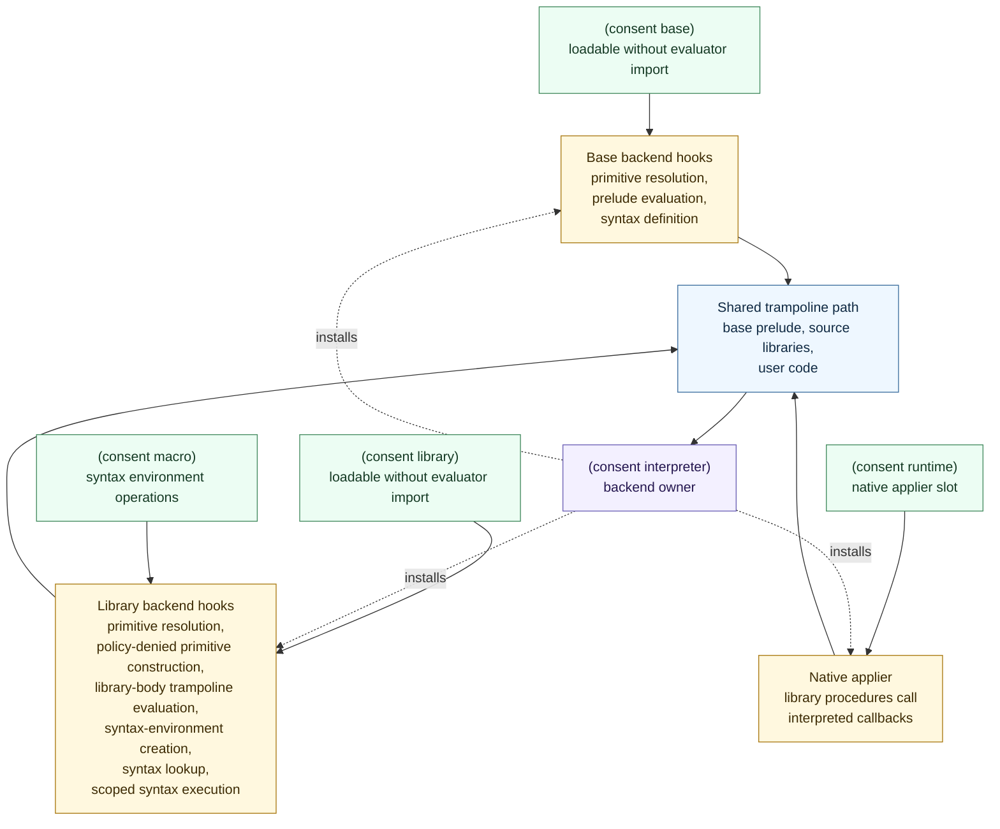
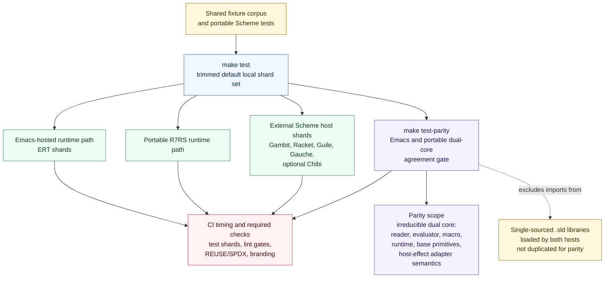

# Runtime Core Diagrams

This page is a visual companion to
[Architecture and Threat Model](architecture.md) and
[Multi-Host Adapter and Bootstrap Strategy](multi-host-bootstrap.md). The
Mermaid blocks below are the primary editable source for these diagrams: they
render in GitHub preview, stay reviewable as text, and should be updated
alongside the modules they describe.

The diagrams describe the current runtime architecture. They do not introduce a
new implementation contract beyond the linked architecture documents.

## Static Rendering Decision

No static SVG or PNG renderings are committed for these diagrams yet. Mermaid
source is the authoritative artifact, and committing generated images now would
add renderer-version churn, binary diffs, and extra SPDX/REUSE bookkeeping before
the repository has an offline manual or PDF documentation pipeline that needs
them.

When static renderings become useful, generate them as derived artifacts under
`docs/assets/diagrams/` with stable names matching these section anchors, record
the Mermaid source as authoritative, and update the asset README plus
`REUSE.toml` as needed. A future rendering pass should pin the Mermaid CLI
version and render each fenced block from this page into the matching asset
file.

## Portable Scheme Runtime Core

The portable runtime side keeps `(consent eval)` thin. Most public evaluation,
REPL, and result-producing entry points are owned by `(consent interpreter)`,
while resolver modules stay loadable by receiving backend hooks after the
interpreter is loaded.

## Emacs Lisp Twin

The Emacs Lisp implementation mirrors the same semantic spine, but
`consent-eval.el` is larger because it is also the first host adapter
orchestration surface. Host-facing policy, audit, stream, capability, session,
and approval behavior lives around the evaluator rather than inside portable
Scheme semantics.

## Evaluation Pipeline

Evaluation accepts either source text or already-read datums. Entry points that
raise host errors and entry points that return `evaluation-result` datums share
the same reader, resolver, macro, trampoline, primitive-dispatch, and rendering
path; only the error boundary changes.

## Library Resolution Flow

Library resolution is part of the frontend because imports install both value
bindings and syntax bindings. Source-backed libraries loaded by both hosts are
one shared implementation, not two copies that require parity testing against
each other.

## Host Boundary And Capability Flow

Pure Scheme data crosses into effects only through capability-backed libraries.
Raw Emacs buffers, windows, processes, filesystem handles, provider clients, and
other live host objects stay behind the adapter boundary.

## Portable And Emacs Value Representation

The two implementations preserve mirrored semantics, but their host-level value
representations differ. The Emacs reader uses wrapper records for Scheme datums
that do not map cleanly onto Emacs Lisp host values. The portable Scheme
implementation can lean more on host Scheme datums, while still owning
Consent-specific records when semantics or stable external representation
require them.

## REPL And Session Lifecycle

Durable interaction contexts keep definitions, imports, and macros across
submissions. Each submission still receives a fresh budgeted eval context, and
the submitted form is read separately from the evaluated program input stream.

## Macro Expansion Lifecycle

The macro subsystem owns syntax environments, `syntax-rules`, local syntax
scopes, and body expansion. Imported syntax bindings are installed alongside
value bindings during library resolution.

## Bootstrap Hooks

The hook structure is deliberate. Base and library resolver modules need to be
loadable without directly importing the interpreter backend, but the base
prelude and source library bodies still evaluate through the same trampoline as
user code.

## Parity And Test Matrix

Cross-host agreement applies to the irreducible dual-core layer: reader,
evaluator, macro, runtime, base primitives, and host-effect adapter semantics.
Single-sourced `.sld` libraries drop out of dual-core parity scope because both
hosts load the same implementation.

