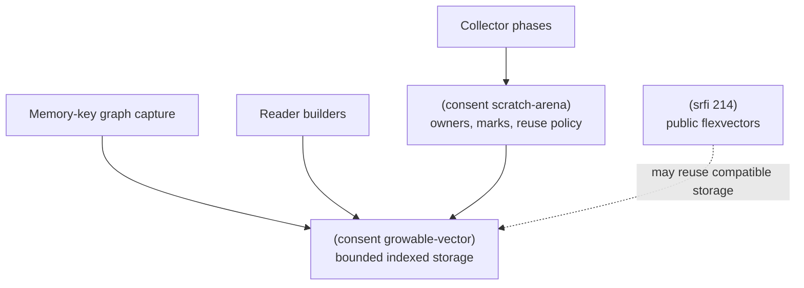
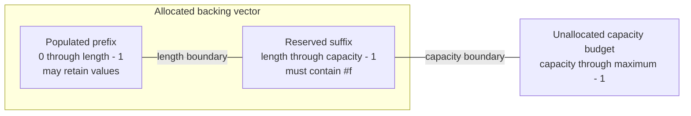
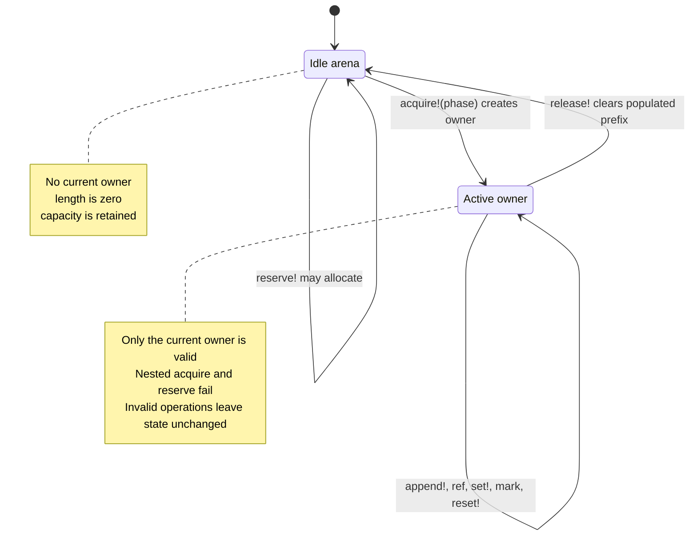

# Bootstrap-Safe Runtime Storage

**Issue:** #968

**Roadmap version:** 0.18.39

**Status:** Implemented

## Summary

Two private, portable libraries provide storage for allocation-sensitive
runtime and graph algorithms:

- `(consent growable-vector)` owns bounded indexed storage and imports only
  `(scheme base)`; and
- `(consent scratch-arena)` layers reusable, phase-owned lifetimes over that
  storage and imports `(consent growable-vector)`.

Neither library imports a public SRFI, calls user code, or depends on an
initialized standard-library shelf. The Emacs bootstrap source loader and
direct or compiled R7RS routes execute the same Scheme sources. A future native
runtime may accelerate the backing storage, but it must preserve the bounds,
clearing, counters, ownership, and failure behavior described here.

The library boundary follows the behavior each abstraction owns:



## Choosing the Storage Layer

Use a growable vector when one algorithm directly owns its storage and lifetime.
Use a scratch arena when storage is reused across calls or runtime phases and a
stale operation must be rejected after cleanup.

| Need | Layer | Why |
| --- | --- | --- |
| Indexed storage with a permanent bound | Growable vector | Smallest API. |
| Reuse with explicit phase ownership | Scratch arena | Stale owners fail. |
| Collector without heap growth | `pre-reserved` arena | Fails full. |
| Temporary safe growth | `allow-growth` arena | Grows boundedly. |

Neither layer is a general sequence abstraction. Both libraries are private,
mutable, callback-free, and deliberately narrower than SRFI 214.

Programs that need the public sequence abstraction import `(stdlib
flexvectors)` or one of its SRFI 214 aliases. That library wraps growable
storage in a distinct public record and owns SRFI validation, callbacks,
conversion, search, and mutation semantics without widening the private
storage API.

## Storage Shape and Invariants

The logical prefix and the allocated backing vector are different bounds. The
configured maximum is a budget, not storage allocated in advance.



At every active-vector boundary:

- `0 <= length <= capacity <= maximum-capacity`;
- only indexes below `length` are populated and addressable;
- every reserved slot at or above `length` contains `#f`;
- clear replaces the backing vector at the immutable initial capacity;
- reset moves `length` to zero without reducing `capacity`; and
- release clears the prefix, replaces the backing vector with an empty vector,
  and permanently makes the growable vector inactive.

The high-water and cumulative counters remain available after release. They
describe the object's history, not its current logical contents.

## Growable Vectors

`(consent growable-vector)` exports the storage operations in this section.
`consent-make-growable-vector` takes an initial capacity, a maximum capacity,
and an optional growth factor that defaults to 2. Capacity bounds are exact
nonnegative integers, the initial capacity must not exceed the maximum, and
the growth factor must be an exact real greater than one. All three policy
values are immutable for that storage object.

The populated prefix is separate from reserved capacity:

- append returns the new element's zero-based index;
- indexed ref and set accept only populated indexes;
- reserve allocates an exact requested capacity when it is larger;
- grow takes the floor of current capacity times the object's growth factor,
  advances by at least one slot, or uses the requested minimum when that is
  larger, without crossing the configured maximum;
- copy performs an overlap-safe populated-prefix move between growable vectors
  and extends the destination prefix when required;
- fill replaces a populated slice without exposing the backing vector;
- snapshot returns a fresh fixed vector containing only the populated prefix;
- truncate clears a populated suffix and publishes the requested shorter
  prefix; scratch arenas use this operation to reset to an owner mark;
- clear atomically replaces the backing vector at the initial capacity;
- reset clears every populated slot to `#f` and retains the capacity; and
- release clears every populated slot, drops the backing vector, and makes the
  growable vector permanently inactive.

These operations are distinct primitive-backend lifetime signals. A native or
collector-aware backend must not collapse them into aliases: clear abandons the
high-water allocation for the initial-capacity backing, reset retains the
allocation for reuse after removing live references, and release relinquishes
the backing and invalidates the object. This contract lets a future Consent
collector apply different heap policies without changing callers.

Append uses geometric growth. With the default factor of 2 and one initial
slot, appending `n` elements copies fewer than `2n` existing elements across
all growths. Every fixed factor greater than one preserves amortized constant
append time; smaller factors trade more copying for less spare capacity.
`consent-growable-vector-stats` exposes logical length, reserved capacity,
maximum capacity, growth factor, high-water length, growth count,
copied-element count, reset count, and released state as Scheme-readable data.

`consent-growable-vector-unused-slots-cleared?` is a private diagnostic for the
garbage-collector root invariant. It scans reserved slots outside the logical
prefix and confirms that none retains a stale value.

### Complexity and Allocation

The table abbreviates the common `consent-growable-vector-` prefix.

| Operation | Time | Backing allocation |
| --- | --- | --- |
| `length`, `capacity`, `ref`, `set!` | O(1) | None. |
| `append!` | Amortized O(1) | Only when full. |
| `reserve!`, `grow!` | O(length) when larger | Only when larger. |
| `copy!` | O(copied slice) | Only when extending past capacity. |
| `fill!` | O(filled slice) | None. |
| `snapshot` | O(length) | Always; returns a copy. |
| `truncate!` | O(removed suffix) | None. |
| `clear!` | O(initial capacity) | Always. |
| `reset!`, `release!` | O(length) | None. |
| `unused-slots-cleared?` | O(capacity) | None. |
| `stats` | O(1) | Allocates the result datum. |

For example, repeated append from initial capacity zero and maximum capacity ten
uses capacities `0, 1, 2, 4, 8, 10`. The next append fails before allocation.
`reserve!` instead requests an exact larger capacity; `grow!` treats its
argument as a minimum and may choose the larger geometric capacity.

## Scratch Arenas

`(consent scratch-arena)` imports `(consent growable-vector)`, owns one such
vector, and issues at most one active owner at a time.
`consent-scratch-arena-acquire!` requires a symbolic phase and returns a fresh
owner lifetime. Every append, ref, set, mark, and reset operation takes that
owner. Release clears the complete logical prefix before the arena can issue
another owner.

Marks are ownership-stamped exact integers. Each owner receives a library-wide
monotonic lifetime token, so a mark from another arena or a released lifetime
is rejected even when the arenas share a capacity and acquisition ordinal.
Reset clears the suffix back to the marked length before publishing the shorter
prefix. A mark beyond the current prefix cannot extend storage after an earlier
reset.

Arena statistics distinguish:

- current logical elements and reserved capacity;
- configured maximum capacity and growth policy;
- high-water logical usage across all lifetimes;
- acquisitions, mark resets, and owner releases; and
- backing-storage growths and copied elements.

The arena has two growth policies:

- `allow-growth` permits active append to allocate geometrically, bounded by
  the configured maximum. It is suitable only when allocation from the
  current runtime heap is allowed or the backing store is an external adapter.
- `pre-reserved` forbids growth while an owner is active. Reserve the arena
  while it is idle, before entering a collector or no-allocation phase. An
  exhausted owner fails closed instead of recursively allocating from the heap
  being collected.

Owner acquisition creates its lifetime token, so a collector must acquire the
owner before entering the portion of a phase in which ordinary allocation is
forbidden. Marks do not allocate compound storage. A compiled adapter may make
the owner token and exact marks immediate values, but cannot weaken their
lifetime checks.

Although a mark is represented by an exact integer, callers must treat it as
opaque. It must not be decoded, adjusted, transferred to another owner, or used
after its owner is released.

### Arena Lifecycle

The arena retains its backing capacity while owner lifetimes come and go. The
owner, not the arena alone, is the capability required for active operations.



Allocation-sensitive code must order the lifecycle deliberately:

1. Reserve the needed capacity while the arena is idle.
2. Acquire the owner before entering the no-allocation section; acquisition
   creates the owner record and lifetime token.
3. Use only owner operations within the reserved capacity.
4. Leave the no-allocation section and release the owner, clearing all roots.

Do not call `snapshot`, either statistics procedure, or other result-building
diagnostics inside a strict no-allocation section. A `pre-reserved` append does
not allocate backing storage, but it fails without changing state when capacity
is exhausted.

### Worked Mark and Reset Trace

This trace keeps one root, discards later temporary work, and then releases the
whole lifetime:

```scheme
(define arena
  (consent-make-scratch-arena 2 8 'pre-reserved))

(consent-scratch-arena-reserve! arena 6)

(let ((owner (consent-scratch-arena-acquire! arena 'trace)))
  (consent-scratch-owner-append! owner 'root-a)
  (let ((mark (consent-scratch-owner-mark owner)))
    (consent-scratch-owner-append! owner 'root-b)
    (consent-scratch-owner-reset! owner mark))
  (consent-scratch-owner-release! owner))
```

The state changes are:

| Point | Active | Length | Capacity | Retained values |
| --- | --- | ---: | ---: | --- |
| After reserve | No | 0 | 6 | None. |
| After acquire | Yes | 0 | 6 | None. |
| At mark | Yes | 1 | 6 | `root-a`. |
| Before reset | Yes | 2 | 6 | `root-a`, `root-b`. |
| After reset | Yes | 1 | 6 | `root-a`; later slots are `#f`. |
| After release | No | 0 | 6 | None; all reserved slots are `#f`. |

The reset increments the arena reset count. Release increments its release
count and invalidates `owner`, while the arena keeps six slots for its next
lifetime.

### Concurrency Boundary

The portable records and the library-wide owner-token counter are not
synchronized. An arena and its growable vector belong to one serialized runtime
execution context at a time. A host that shares them across native threads must
serialize access or provide an adapter with equivalent atomic ownership and
publication behavior. Owner checks prevent stale-lifetime use; they are not a
data-race primitive.

## Dynamic Extent and Re-entry

The storage API accepts no procedure, comparator, hash function, or element
callback. A caller that needs dynamic cleanup acquires an owner first and pairs
it with `dynamic-wind`:

```scheme
(let ((owner (consent-scratch-arena-acquire! arena 'trace))
      (reentered? #f))
  (dynamic-wind
   (lambda ()
     (if (not (consent-scratch-owner-active? owner))
         (set! reentered? #t)))
   (lambda ()
     (if reentered?
         (error "scratch owner cannot be re-entered")
         (begin
           ;; Perform the trace using OWNER.
           ...)))
   (lambda ()
     (if (consent-scratch-owner-active? owner)
         (consent-scratch-owner-release! owner)))))
```

Normal return, an exception, or a continuation escape runs the release thunk
and clears retained roots. Re-entering a continuation captured inside the body
runs the before thunk against the same released owner, records re-entry, and
fails closed from the body after surrounding dynamic state is restored. The
before thunk deliberately does not raise: Scheme hosts differ in how much
dynamic state they restore before a failing before thunk. An escaped owner also
remains invalid after the arena is acquired for a later phase.

The explicit pattern keeps callback invocation out of the storage primitive.
Collector and runtime code own their control transfer, while the arena owns
storage lifetime and validation.

## Failure Contract

Capacity, index, ownership, and phase failures raise Scheme errors with stable
messages and Scheme-readable irritants. Exact Scheme arithmetic determines
growth requests, so capacity calculation cannot wrap into a smaller positive
allocation. A request above the configured maximum fails before allocation.

Host `make-vector` failure is caught and normalized to a storage-allocation
error containing the requested capacity. New backing storage is published only
after allocation and prefix copying complete. Failed growth therefore leaves
the previous backing vector and its logical prefix authoritative.

The following cases fail closed:

- malformed or inverted capacities;
- malformed, negative, or unpopulated indexes;
- reserve or growth beyond the configured maximum;
- active growth in a `pre-reserved` arena;
- nested acquisition or reserve while an owner is active;
- a released or non-current owner operation; and
- a reset mark from another owner lifetime or beyond the current prefix.

## Scheme Corpus Audit

The repository-wide audit used three questions for each apparent accumulator:

1. Is the final value vector-like, or is a list, string, bytevector, queue, or
   hash table the actual abstraction?
2. Is the final length unknown during the one pass that produces elements?
3. Must the code run before optional standard libraries are realized, and can
   it remain bounded and callback-free?

Passing all three questions is a strong primitive-storage fit. Code that calls
user procedures or implements an optional public sequence belongs above the
bootstrap boundary and should use SRFI 214 instead.

### Primitive Refactors

The memory-key graph capture already uses private growable vectors for dense
labels, edges, and canonical descriptors. That remains the highest-value use:
the final shape is a vector, graph size is not known before traversal, and the
algorithm runs on a bootstrap path.

The reader now uses the same primitive in two further places:

- source-location indexing appends line starts while its existing exact-size
  offset-to-line vector is filled; and
- vector and bytevector literal parsing appends elements under the reader's
  configured length ceiling, snapshots once, and then either returns the host
  vector or fills an exact-size owned vector or bytevector.

Both builders know a permanent maximum before appending, invoke no user code,
and discard their private capacity after producing a detached result. They
remove intermediate cons cells and reverse passes without changing reader
limits, element order, source metadata, or owned-datum construction.

### Public Flexvector Collector Refactors

Two optional standard-library modules now use the public flexvector surface:

- SRFI 42 `vector-ec` and `string-ec` collect unknown comprehension output
  with `flexvector-add-back!`, then use `flexvector->vector` or
  `flexvector->string`; and
- SRFI 158 `generator->vector`, `vector-accumulator`, and
  `reverse-vector-accumulator` avoid intermediate lists through
  `generator->flexvector`, back insertion, conversion, and reversal.

These paths execute user expressions or generator procedures and expose
standard-library behavior. They therefore must not depend directly on the
callback-free primitive, even if the SRFI 214 implementation internally reuses
compatible primitive storage.

### Candidates Rejected or Deferred

- Explicit traversal stacks and FIFO worklists in `(consent datum)`,
  `(consent interpreter)`, `(consent result)`, `(consent symbol-boundary)`,
  `(consent library)`, `(agent memory-key)`, and `(agent memory-query)` need
  push/pop or queue/deque semantics. Issue #969 owns that bootstrap worklist
  abstraction; treating a populated vector prefix as an ad hoc queue would
  recreate the duplication that the foundation issues are meant to remove.
- `(data transient-map)` grows an open-addressed hash table. Its sparse slots,
  probing, deletion markers, and rehash threshold are not a growable sequence;
  replacing its backing vector with this primitive would hide rather than
  simplify the table invariants.
- Fixed-size vector operations in the evaluator, datum heap, numeric backend,
  base prelude, and native bridge already know their result length. Exact
  allocation and direct indexed filling are cheaper and clearer than geometric
  growth.
- Reader string and escaped-symbol accumulators are already linear and usually
  small. Promoting every token to a record plus backing vector would add fixed
  overhead; a future character or string builder should be justified by
  profiles rather than by sequence resemblance alone.
- Writer fragments and interpreter string or bytevector port refills ultimately
  need contiguous text or bytes, not object slots. The refill paths deserve a
  chunked byte/string buffer review because repeated concatenation can copy
  quadratically, but an object growable vector would complicate cursor access
  and unread-remainder semantics instead of solving that representation need.
- Ordinary `cons` plus `reverse` loops that intentionally return lists should
  stay lists. Avoiding lists is not itself a reason to cross the storage-layer
  boundary.

## Layering and Consumers

The memory-key canonicalizer now uses `(consent growable-vector)` for its dense
label, edge, and descriptor vectors. Its graph semantics and asymptotic gates
remain owned by `(agent memory-key)`; only the compatible storage machinery
moved.

The reader uses per-call growable vectors for line-start and literal-element
builders. It snapshots before publishing a result and releases the private
storage during dynamic cleanup, so capacity and lifecycle policy cannot escape
through the reader API.

SRFI 214 flexvectors reuse the private storage where the semantics agree. The
public layer does not expose collector phase, reserve, reset, release,
maximum-capacity, or allocation-policy details as SRFI behavior. SRFI 158
vector collectors and SRFI 42 vector and string comprehensions use that public
layer so long collections avoid intermediate reversed lists.

The backing policy intentionally differs from the official SRFI 214 sample in
one non-semantic detail: `flexvector-copy` right-sizes new storage to the copied
length, subject to the four-slot minimum, instead of preserving spare source
capacity. Flexvector storage selects the sample's 3/2 growth factor through the
private per-object policy, while other primitive consumers retain the private
constructor's default factor of 2. These are implementation policies, not SRFI
guarantees, and may be retuned from benchmark evidence.

`flexvector-clear!` follows the official sample by invoking private clear on
storage whose immutable initial capacity is four slots. Constructors reserve
more storage when needed without changing that clear floor. The private
operation allocates replacement storage before mutation, so the old value
survives allocation failure. On success, the high-water backing vector becomes
unreachable and eligible for collection, so repeated grow-and-clear cycles do
not permanently retain their largest historical allocation. Explicit
`consent-growable-vector-reset!` instead retains capacity for scratch storage
whose caller intends reuse.

Bulk flexvector insertion, removal, copying, and filling use private
`vector-copy!` and `vector-fill!` operations owned by `(consent
growable-vector)`. Copying is overlap-safe, including self-copy, while the raw
backing vector remains outside both the SRFI and internal-library interfaces.

The baseline and incremental collectors in #335 and #966 consume
`pre-reserved` arenas. They must reserve and acquire outside the no-allocation
trace section and treat capacity exhaustion as a Scheme-readable collection
failure, not as permission to allocate from the heap under collection.

## Verification

`tests/scheme/consent-growable-vector-test.scm` covers zero and maximum capacity
boundaries, a deterministic capacity/model sweep, no-op transitions, copy
counters, overlap-safe bulk copy and fill, state preservation after failed
operations, reset and release clearing, idempotent release, and stable
representative errors.
`tests/scheme/consent-scratch-arena-test.scm` covers both growth policies,
active and idle statistics, cross-arena and stale marks, escaped owners,
exception cleanup, dynamic-wind, continuation re-entry, and a pre-reserved
synthetic collector workload. The portable plan runs both programs on direct
and compiled routes. ERT imports each internal library independently through
the Emacs source-library loader, proving that both bootstrap surfaces use their
portable source implementations.
The official SRFI 214 repository provides `implementation/tests.scm`. Consent
pins that file at the manifest's upstream revision and SHA-256 and carries its
111 assertions in
`tests/scheme/stdlib-flexvectors-upstream-test.scm`, adapted only to use the
local library imports, SRFI 64 implementation, and fail-closed runner. The
upstream assertions mention 64 of the 66 exported procedures; they omit
`list->flexvector` and `reverse-list->flexvector`. They also do not exercise
every optional argument, specified error boundary, mutator return contract, or
short-circuit rule.

`tests/scheme/stdlib-flexvectors-test.scm` closes those gaps with 17 registered
cases and 35 assertions for list and sliced conversions, clamping,
multiple-seed unfolds, every mutator return category, append-at-length
`flexvector-set!`, the optional
`flexvector-remove-range!` end, empty and reversed-range errors, shortest-input
parallel iteration, strict short-circuiting, self-aliasing, overlapping edits,
searches, and long inputs. Together, the two portable programs exercise all 66
exports. The exact 66-name manifest export list and all four import aliases are
asserted through the Emacs source loader. Both portable programs run on every
direct and compiled host route selected by the portable test plan.

The portable layer cannot safely force a host `make-vector` out-of-memory
condition or observe garbage-collector reachability. The suite therefore checks
every deterministic pre-allocation failure for state preservation and uses the
unused-slot diagnostics as its root-clearing oracle. A future native allocator
adapter must provide deterministic fault injection for its allocation-failure
normalization path rather than attempting a process-level exhaustion test.
